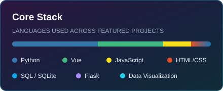

# Hi, I'm ZhongLi 👋

> Master's in Electronic Information Engineering | IT infrastructure & research institute background | Research interests: Computer Vision, Mobile Robot Path Planning, Vibe Coding. Glad to connect!

## Languages

## Technologies

## Personal Projects

## GitHub Stats

